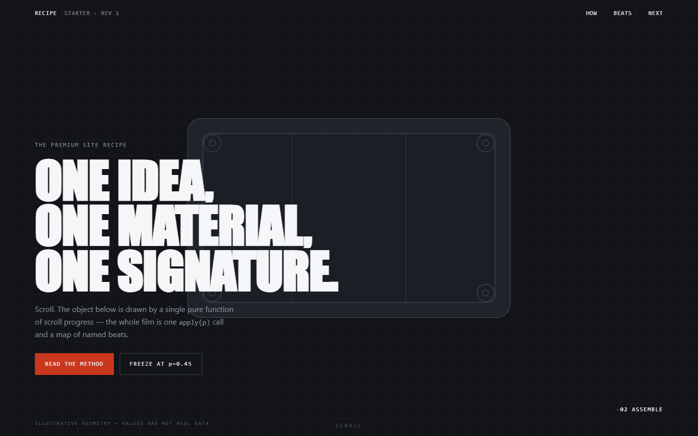
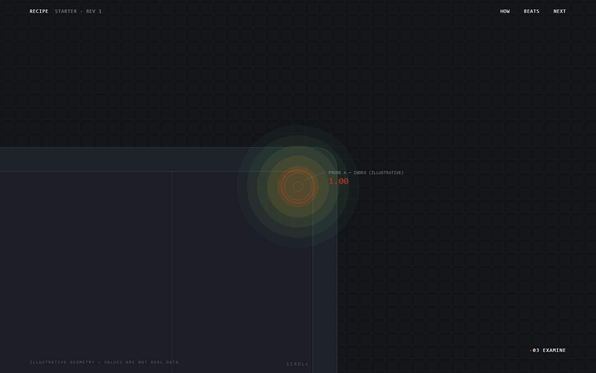
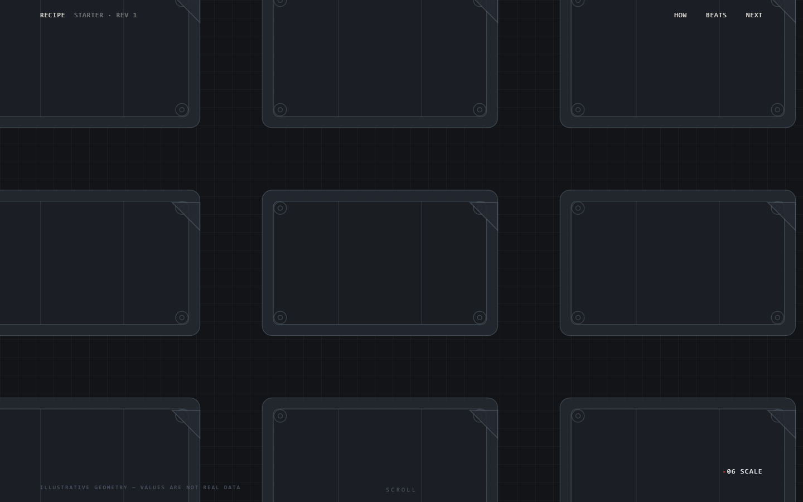

# The Premium Site Recipe

A reproducible method for building websites that feel expensive — cinematic scroll, one
signature animated object, motion that means something — **without** a build step, a
framework, or a 5 MB payload.

It came out of building one static site to that standard and measuring everything that
went wrong along the way. What's here is the method and the traps, stripped of the
subject matter. It works for a portfolio, a product launch, a research page, a band, a
restaurant, a hardware startup, a conference.

**Stack it assumes:** plain HTML + CSS + vanilla JS, three small libraries (GSAP +
ScrollTrigger, Lenis, optionally Three.js), served as static files. No bundler, no npm at
runtime. Everything here ports to React/Next/Astro — the architecture is the point, not
the file layout.

- **New here?** Read this page, then [SETUP.md](SETUP.md), then run `starter/`.
- **Want the detail?** [recipe/](recipe/) has one document per step, with full code.
- **Want to skip our mistakes?** [LESSONS.md](LESSONS.md) is the expensive part.
- **Want to check our claims?** [SOURCES.md](SOURCES.md).

---

Three frames from the included `starter/`, captured at fixed scroll-progress values —
`?p=0.16`, `?p=0.42`, `?p=0.97`. One pinned section, one pure function, no video:





Being able to address any moment of the film by a number — and screenshot it — is not a
nicety here. It's what the whole method is built on. Those three images were produced by
one command (`node tools/shots.mjs`), and so was the review pass that found three bugs in
this scene before it shipped.

The starter measures **89 KB first load, 1.58 s mobile LCP** under 4× CPU throttling, and
**0.0000 CLS**.

---

## The thesis

Premium is not more effects. Most sites that read as cheap have *more* motion than sites
that read as expensive — the motion just doesn't mean anything.

Four properties do the work:

1. **One idea, stated once.** A single sentence you can say out loud, and a single
   signature object that embodies it.
2. **One material.** The whole page is made of the same stuff — one palette family, one
   surface treatment, one border language, top to bottom. No "and here's the light
   section."
3. **Motion that encodes information.** Every animated thing reveals something true about
   the subject. Decoration that encodes nothing is the tell.
4. **Ruthless subtraction.** A written banned list you actually enforce.

Everything below is machinery for those four.

---

## The recipe

### Step 0 — Write the thesis sentence

Before any code, finish these two sentences:

> This page's single job is to make **\_\_\_\_** undeniable within one scroll.
>
> The signature element is **\_\_\_\_**, and it changes as you scroll because **\_\_\_\_**
> is the true story of the subject.

If you can't fill in the second one, you don't have a signature — you have a decoration.
Go back.

### Step 1 — Steal a vernacular, not a style

The highest-leverage move in the whole recipe. Don't pick "minimal" or "brutalist." Pick
the *visual language your subject already lives inside*, and render the entire site in it:

| Subject | Vernacular to steal |
|---|---|
| Hardware / engineering | Engineering drawings — linework, title blocks, revision stamps, dimension lines |
| Scientific research | Lab notebook, plate readouts, journal figure captions, error bars |
| Finance / data | Terminal, ticker tape, monospace tables, candle grids |
| Film / music | Contact sheets, edit timelines, waveforms, timecode, film leader |
| Architecture | Site plans, elevation callouts, section cuts, material swatch cards |
| Food | Menus, recipe cards, market handwriting, tasting notes |
| Fashion | Lookbook grids, pattern-cutting marks, garment tags, care symbols |
| Aviation / logistics | Flight strips, manifests, gate boards, approach plates |
| Publishing / law | Galley proofs, marginalia, footnote rules, redlines |

A vernacular hands you free, non-generic answers to every micro-decision — what a caption
looks like, what a divider is, how sections are numbered, what the empty state says.
That's why vernacular sites don't look templated: no template guesses that your section
headers should be numbered `SHT 3 OF 4`, or that your loading state should read
`SPOOLING`.

Then commit to the rule that makes it work: **every decorative device must encode
something true.** A revision stamp shows a real revision. A dimension line measures a real
thing. If it's fake, delete it.

### Step 2 — Write the brief before the code

One file, one page, non-negotiable once agreed. Six sections: subject & job, thesis &
signature, tokens, scroll structure, copy rules, banned list. Template:
[recipe/brief-template.md](recipe/brief-template.md).

This is also what makes AI-assisted building produce a site instead of slop — the brief is
what the agent is held to, and what you diff against when something drifts.
See [recipe/01-brief.md](recipe/01-brief.md) and [recipe/08-ai-workflow.md](recipe/08-ai-workflow.md).

### Step 3 — Build the token layer first, as one material

Ten to fifteen CSS custom properties, defined once, before a single component: one ground,
one panel, one deep panel, two line weights, three text tints, **one** accent — plus a
written rule about where the accent may appear. Reserve any second color family for
exactly one job (ours was reserved for a single data visualization and appeared nowhere
else on the page).

Three fonts maximum, each with a job: display / body / mono-for-data. Self-host `.woff2`,
`font-display: swap`, and preload only the weights that render above the fold.

Copy-paste token block: [recipe/02-tokens.md](recipe/02-tokens.md).

### Step 4 — Three tiers of motion, and only three

Adding a fourth tier is how sites start to feel busy.

**Tier 1 — Page glide.** Smooth scroll (Lenis), `lerp` ≈ `0.08–0.1`. Fine pointers only,
off under reduced motion. It's what makes everything else feel connected.

**Tier 2 — One pinned scrub.** Exactly one section pins and converts scroll distance into
a timeline. The signature lives here. Everything else on the page stays quiet so this
reads as the event.

**Tier 3 — Reveal on enter.** One 2-line CSS class applied to a list of selectors, fired
once by ScrollTrigger at `top 82%`. Two properties, ~700 ms, one curve, no stagger beyond
a small index delay. Uniform reveals read as confident; bespoke ones read as fussy.

The one non-obvious trick — **scrub through a proxy object**:

```js
const proxy = { p: 0 };
gsap.to(proxy, {
  p: 1, ease: "none",
  scrollTrigger: {
    trigger: ".hero", start: "top top", end: "+=500%",
    pin: ".hero-pin", scrub: 0.5,
  },
  onUpdate() { setSceneProgress(proxy.p); },   // your scene reads proxy.p
});
```

`scrub: 0.5` makes `proxy.p` *glide* toward the true scroll position instead of snapping
to it, so discrete mouse-wheel ticks become one continuous motion. Driving the scene from
`proxy.p` instead of from the trigger's raw progress is most of the difference between
"scroll animation" and "film."

Full code: [recipe/03-motion.md](recipe/03-motion.md).

### Step 5 — The signature: `apply(p)` as a pure function

The architectural core, and the part that transfers to anything — Three.js, 2D canvas,
SVG, or plain DOM.

**Rule: the scene exposes exactly one entry point, `apply(p)`, a pure function of progress
`p ∈ [0,1]`.** No internal animation state, no "current step," no accumulators. Same `p`
in, same frame out, forever.

Choreography lives in a named segment map, kept separate from the code that reads it:

```js
const SEG = {                 // named beats, in scroll-progress space
  wire:    [0.00, 0.08],
  build:   [0.08, 0.20],
  zoom:    [0.20, 0.30],
  analyze: [0.30, 0.55],
  scale:   [0.90, 1.00],
};
const seg01 = (p, [a, b]) => Math.min(1, Math.max(0, (p - a) / (b - a)));
const ease  = (t) => t * t * (3 - 2 * t);            // smoothstep
const ss    = (p, a, b) => ease(seg01(p, [a, b]));   // eased 0→1 across a beat
```

`apply(p)` then becomes a wall of `const zoom = ss(p, ...SEG.zoom)` lines feeding
opacities, positions, and camera lerps. Retiming the entire film is editing one object.
Cutting a beat never touches drawing code.

Why purity matters more than elegance here:

- **Scrubbing backwards works for free.** Most hand-rolled scroll scenes break going up.
- **You can screenshot any moment**: `apply(0.62)`, render, capture. That's what makes the
  verification loop in Step 6 possible, which is what makes AI iteration possible.
- **Deep links and fast scrolls can't desync it** — there is no state to desync.
- Time-based motion (an idle sway) is allowed as a *second* argument whose amplitude is
  itself a function of `p`, so it's exactly zero everywhere determinism matters.

Full pattern plus the Three.js material and lighting settings that stopped our object
looking like plastic: [recipe/04-signature-scene.md](recipe/04-signature-scene.md).

### Step 6 — Verify with a screenshot rig, not vibes

You cannot art-direct a scroll-scrubbed scene by scrolling manually. Build two debug hooks
on day one:

- `?p=0.42` — force the signature scene to a progress value and freeze it.
- `?ss=2000` — translate the page up by N pixels instead of scrolling, so a headless
  browser can shoot lower sections (real pre-paint scrolling blanks headless captures).

Both disable smooth scroll and the pin. Then a 12-shot contact sheet at
`p = 0, 0.09, 0.18 …` is one command, and you review the film as a storyboard.
`tools/shots.mjs` does exactly that.

[recipe/05-verify.md](recipe/05-verify.md)

### Step 7 — Budget performance, then defend it

Targets that kept ours honest, all measured with `tools/measure.mjs`:

| Metric | Budget |
|---|---|
| First-load transfer | ≤ 500 KB (a 3D hero eats ~200 KB of it) |
| LCP, mobile emulation, 4× CPU throttle | ≤ 2.5 s |
| CLS | ≤ 0.01 |
| Longest boot task | ≤ 500 ms |
| Idle frame cost in the pinned section | ~0 ms — the loop must sleep |

The three traps that cost us the most, all measured, all in [LESSONS.md](LESSONS.md):

1. **A heavy module blocks your text LCP.** `defer` and `type="module"` scripts execute in
   document order. Our scene module's synchronous build was a 0.9 s desktop / 2.1 s
   throttled-mobile task sitting *in front of* the script that animates the headline.
   Moving one `<script>` tag to last took mobile LCP from 5.6 s to ~2 s.
2. **rAF loops that never sleep.** Rendering every frame while nothing changes costs the
   same as rendering during motion — we measured identical 50 ms frames idle and moving.
   Gate on `IntersectionObserver` **and** a dirty check, and stop scheduling frames.
3. **Invisible objects still cost draw calls.** `opacity: 0` is not free; toggle `.visible`
   when a group's contribution rounds to zero. Read the depth-write trap in LESSONS.md
   first — we broke a hidden-line effect by culling something "invisible."

[recipe/06-performance.md](recipe/06-performance.md)

### Step 8 — Enforce the banned list

Written down, in the brief, grep-able. Ours, which you should adapt rather than copy: no
particle fields, no purple gradients, no tilted or rotated cards, no custom cursors, no
preloader percentage counters, no per-letter text splits, no glassmorphism/backdrop-blur,
border-radius ≤ 3 px, one kinetic-type moment maximum, real photography over decorative 3D
everywhere except the single signature object.

None of these are bad in isolation. They're banned because they are the *default
vocabulary of templated and generated sites* — a page using three of them reads as generic
no matter how well executed. Writing your own list is fine. Not having one is not.

[recipe/07-anti-slop.md](recipe/07-anti-slop.md)

### Step 9 — Accessibility is part of the recipe, not a pass at the end

- `prefers-reduced-motion: reduce` means **static end states and no pin**, not "less
  motion." Reveals start visible, the signature renders one good frame, the pinned section
  becomes an ordinary section. About 10 lines total.
- Keyboard focus must survive the pin — tab through the pinned section and watch.
- `mix-blend-mode: difference` on a fixed nav stays legible over both a dark canvas and a
  bright photo with no scrim, but verify contrast against your actual extremes.
- Every image gets `aspect-ratio` + `object-fit: cover` so lazy images can't shift layout.

---

## What's in this repo

```
README.md            this file — the recipe
SETUP.md             prereqs, install, run, deploy
LESSONS.md           every trap we hit, with the fix and the evidence
SOURCES.md           references, and how to verify the claims yourself
CONTRIBUTING.md      how to add a lesson or a starter variant
recipe/              one document per step, with full code
  brief-template.md  fill-in-the-blank design brief
starter/             a working site: pinned scrub + segment scene + reveals
tools/               measure.mjs (perf evidence), shots.mjs (contact sheets)
```

## Quick start

```bash
cd starter && python -m http.server 8734
```

Open <http://localhost:8734>, scroll the hero, then open <http://localhost:8734/?p=0.45>
to see the debug hook freeze the scene mid-film. Prereqs, the measurement tooling, and
deploy notes are in [SETUP.md](SETUP.md).

## Honest scope

This recipe optimizes for *one memorable page*. It is not a CMS pattern, it does not scale
to a 200-page marketing site, and the single-pinned-signature idea gets weaker the more
pages you apply it to. Every number quoted here is from one build on one machine —
reproduce them on yours with `tools/measure.mjs` before treating them as targets.

MIT licensed. Take it apart.
